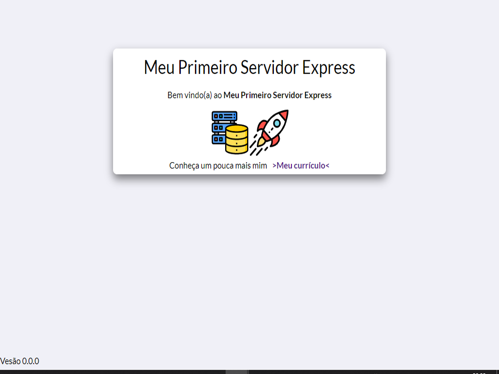

<h1 align="center">Currilo Expresso</h1>

Aprendendo Node.js e Express criando um site básico via server render com EJS

<h1 align="center">
  
</h1>

### 🛠 Tecnologias

- [Html]
- [Css]
- [JavaScript]
- [Node.js]
- [Express]
- [EJS]

### Features

-[x] Rotas
-[] Utilização de links externos

### Como Rodar

npm install

npm run dev

### Autor
---

  
 <b>Joao Paulo Romualdo</b></a>🚀</a>

